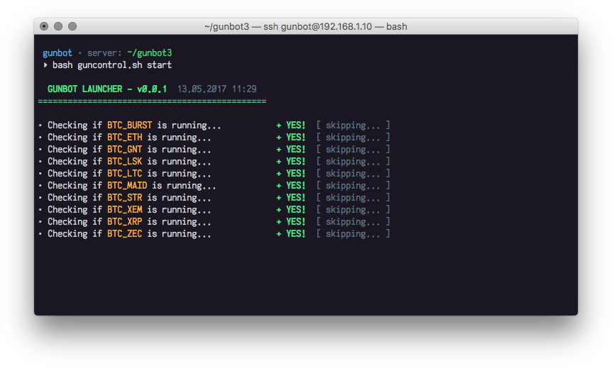

# GunControl
## Custom *nix launcher for GunBot

---

**v0.0.1** • May 2017.

I'm using [**GunBot**](https://gunthy.org) for quite some time mostly on various *nix-based VPS, so the process of editing and re-re-running all trading pairs might consume a lot of time. To optimize this part I have created very simple shell-script for simultaneously starting/stopping all config files in GunBot folder. So, please welcome GunControl!

[**GunControl**](https://github.com/densmirnov/guncontrol) will help you run all trading pairs simultaneously. Script will search GunBot folder for correct *.js* config files and will try to run'em all as background processes with [`screen`](https://www.gnu.org/software/screen/). 

Put [`guncontrol.sh`](https://raw.githubusercontent.com/densmirnov/guncontrol/master/guncontrol.sh) in the GunBot folder and run it with *bash*. You can use built-in script commands to start/stop trading for all pairs or just show a list of currently running pairs. 

**Usage**: `bash guncontrol.sh [ start [pair] [exchange], stop [pair], list ]`



---

```
Denis Smirnov / densmirnov@me.com / densmirnov.com

BTC: 1denG4FjcXDeGSYeiv65R6Eyi3HWo7R8j
ETH: 0xa4C7fACEFC08e684Cd9043c3e31C86Dfb88DF75a
LSK: 10061645427951005252L
```

  
